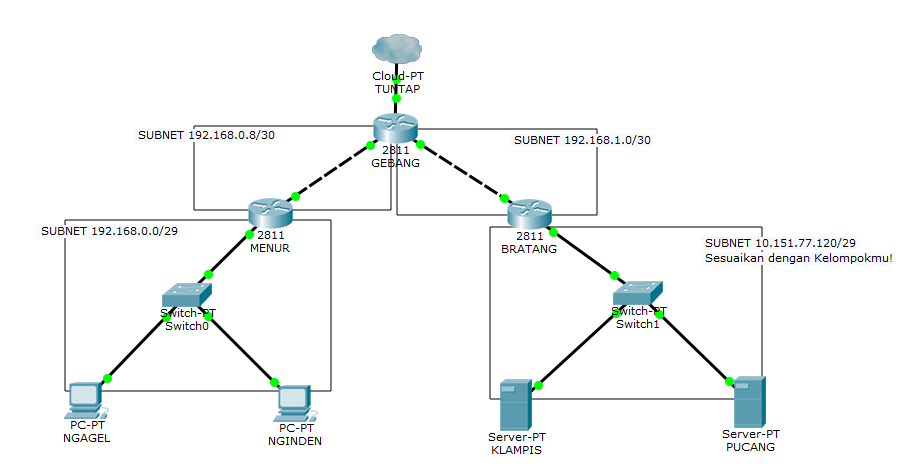
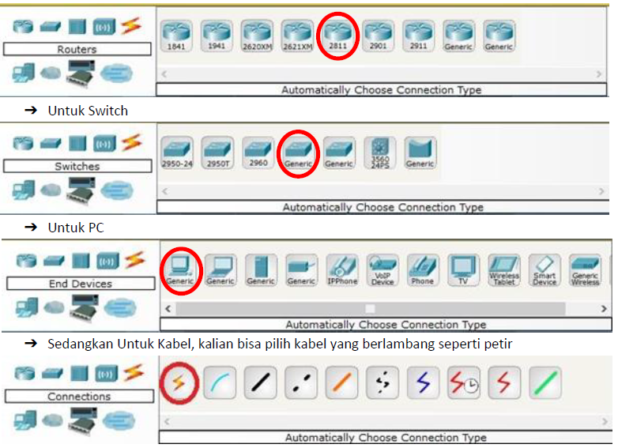
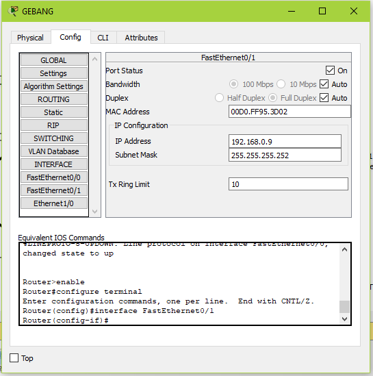
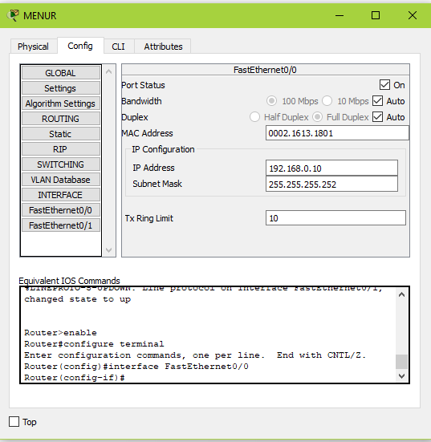
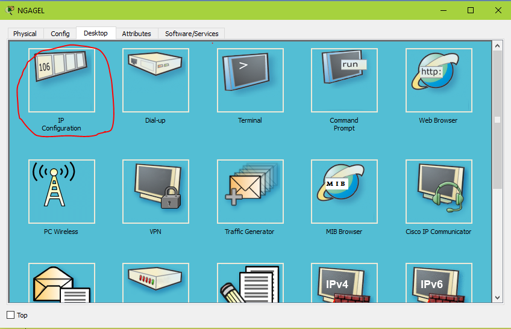
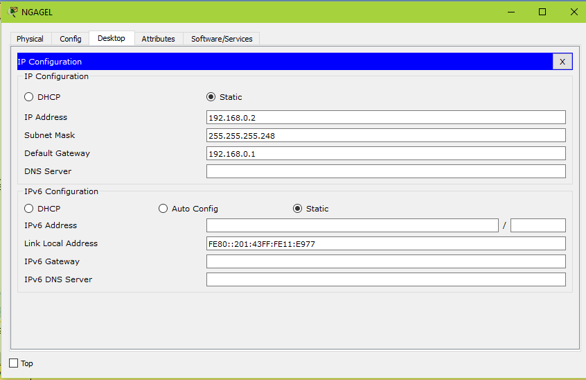
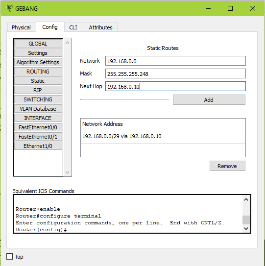
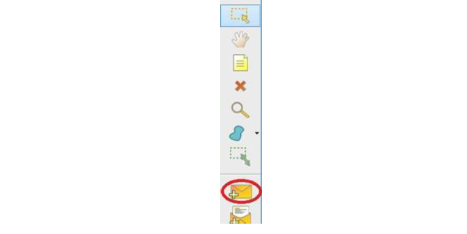

# SUBNETTING & ROUTING

## A. PENGENALAN
*gambar*

Apa yang dimaksud dengan netmask, address, dan gateway dari gambar di atas?

#### Istilah
Istilah | Penjelasan
--------|-----------
iface | Disebut network interface, antarmuka yang menghubungkan 2 layer protokol. Setiap interface memiliki nama yang berbeda
eth0 | Salah satu nama interface yang digunakan untuk berhubungan dengan subnet
address | Sebuah alamat IP unik bagi komputer dalam sebuah jaringan
netmask | Kombinasi angka-angka sepanjang 32 bit yang berfungsi membagi IP ke dalam subnet-subnet dan menentukan rentang alamat IP pada subnet yang bisa digunakan
gateway | Alamat IP pintu keluar menuju jaringan lain, biasanya diisi alamat IP router terdekat

<b>Mengapa Perlu Subnetting?</b>

Sebagaimana rumah yang memiliki alamat masing-masing (unique), setiap komputer dan device yang terhubung dengan jaringan harus memiliki alamat, yaitu berupa IP Address. Sebagai permisalan, wilayah di Indonesia perlu dibagi-bagi menjadi kota, kecamatan, dan desa. Mengapa demikian? Dengan alasan yang semisal, jaringan juga perlu dibagi menjadi subnet (sub-network).

<b>Mengapa Perlu Routing?</b>

Sebagai permisalan, ketika Anda ingin mengantar surat, Anda perlu mencantumkan alamat yang dituju pada surat itu sendiri. Kemudian Anda kirim ke kantor pos, lalu kantor pos akan mengirimkan ke alamat yang dituju. Bagaimana kantor pos mengirim surat tersebut?
Tentu pak pos perlu mengetahui rute perjalan agar surat sampai ke tujuan, seperti itulah routing itu. Untuk mencapai IP Address, perlu diketahui rute untuk menuju IP Address yang dimaksud.

### IP ADDRESS
IP Address (Versi 4)

- Alamat IP adalah suatu alamat unik yang diberikan untuk menandai sebuah komputer yang terhubung dalam suatu jaringan.
- Alamat IP terdiri dari 32 bit biner yang dalam penulisannya dikonversi menjadi bilangan desimal.
- Alamat IP (yang panjangnya 32 bit itu) dibagi menjadi 4 oktet (masing-masing oktet berisi 8 bit) dipisahkan dengan tanda titik.

### Subnet

    
Apa yang dapat anda simpulkan dari tabel di atas?

### Network ID, Broadcast Address, dan Available Hosts
Jika suatu PC memiliki alamat 10.151.36.5/24, maka informasi yang dapat digali dari IP tersebut adalah:

1. Alamat IP
2. Netmask
3. Network ID (NID) : Sebuah alamat IP yang menjadi identitas untuk suatu jaringan/subnet
4. Broadcast Address : Sebuah alamat IP yang menjadi alamat untuk pengiriman pesan broadcast dalam suatu jaringan/subnet
5. Available Hosts: Rentang alamat IP yang bisa digunakan dalam suatu jaringan/subnet

Contoh skenario:
    Carilah Network ID (NID), Broadcast Address dan rentang alamat IP dari IP 10.151.36.5/24!
    
Penyelesaian :
    Informasi sementara yang didapat dari 10.151.36.5/24 adalah:
    
        1. IP : 10.151.36.5
        2. Netmask : 255.255.255.0 (/24)
        3. Network ID?
        4. Broadcast Address?
        5. Available Host?
   
   Berikut akan dijelaskan bagaimana mencari NID, Broadcast Address, dan Available Host:
   
#### Network ID
Mencari Network ID (NID) :

#### Broadcast Address

#### Available Hosts
Mencari Rentang Alamat IP:

### IP Publik dan IP Privat
Alamat IP dibagi menjadi 2 jenis, yakni IP Publik dan IP Privat. Rentang IP Privat adalah:

- 10.0.0.0/8 (IP Privat Kelas A)
- 172.16.0.0/12 - 172.31.0.0/12 (IP Privat Kelas B)
- 192.168.0.0/16 (IP Privat Kelas C)

Sedangkan rentang IP Publik selain rentang IP Privat di atas.

### Let’s Wrap and Warm Up!

    
#### LATIHAN!
Nah, sekarang coba kerjakan soal latihan di bawah ini dan silahkan diskusikan bersama asisten masing-masing.

   1. Carilah Network ID, Broadcast Address dan rentang alamat IP dari 10.151.36.0/24
   1. Carilah Network ID, Broadcast Address dan rentang alamat IP dari 172.16.1.27/29
   1. Apakah IP 10.151.36.0/24 memiliki rentang IP yang sama dengan 10.151.36.5/24?
   1. Apakah IP 10.151.36.0/24 dengan 10.151.36.5/24 bisa disebut sebagai satu subnet? Mengapa?
   1. Apakah IP 10.151.34.14/24 dengan 10.151.36.5/24 bisa disebut sebagai satu subnet? Mengapa?
   1. Kira-kira, bisakah IP yang berbeda subnet pada device yang berbeda saling berkomunikasi langsung tanpa perantara router?
   
## B. SUBNETTING
### Pengertian
*gambar*

<b>Subnet</b> adalah suatu sub jaringan dari jaringan yang lebih besar. Subnet diperlukan sebagai penanda suatu jaringan tertentu. Dengan adanya subnet, kita dapat melakukan manajemen suatu jaringan dengan lebih baik.

Tujuan utama kita belajar subnetting ini adalah pembagian alamat IP untuk kebutuhan tertentu. Sebagai contoh di gedung departemen informatika ini. Pada gedung departemen informatika terdapat beberapa laboratorium, dan setiap laboratorium memiliki lebih dari 1 komputer yang harus dikonfigurasikan sedemikian rupa sehingga dapat saling berkomunikasi bahkan hingga dapat mengakses internet.

Dari contoh diatas, muncullah salah satu konfigurasi paling dasar dalam penyelesaian permasalahan ini yaitu pembagian alamat IP untuk setiap laboratorium yang ada di gedung departemen informatika.

Contohnya :
1. Laboratorium LP memiliki jaringan dengan subnet 10.151.34.0/24
2. Laboratorium AJK memiliki jaringan dengan subnet 10.151.36.0/24

### Perhitungan Subnet
Tujuan utama adanya subnetting ini adalah adanya pembagian alamat IP untuk kebutuhan tertentu. Sebagai contoh ketika terdapat sebuah perusahaan yang memiliki gedung dengan beberapa ruangan dan setiap ruangan memiliki banyak komputer yang harus dikonfigurasikan sedemikian rupa sehingga dapat saling berkomunikasi bahkan hingga dapat mengakses internet. Muncul lah salah satu konfigurasi paling dasar dalam penyelesaian permasalahan ini yaitu pembagian alamat IP untuk setiap ruangan yang ada di gedung perusahaan tersebut.

Ada dua teknik pembagian IP yang dikenal dalam dunia jaringan, yaitu :
#### A. Classfull
Pembagian IP dengan menggunakan teknik ini didasarkan pada pembagian class pada alamat IP. Setiap subnet yang ada di dalam jaringan akan memiliki ukuran atau netmask sesuai ukuran yang ada di pembagian class, disesuaikan dengan jumlah komputer yang ada.

class | Netmask | Jumlah Host
------|---------|------------
Class A | /8 | 4 Milyar
Class B | /16 | 65536
Class C | /24 | 256

Tabel di atas menunjukkan netmask setiap class dan jumlah komputer yang bisa digunakan. Sebagai contoh pembagian IP dengan menggunakan metode classfull adalah sebagai berikut.

Anggap kita memiliki topologi jaringan seperti pada gambar di atas. Kemudian tentukan jumlah subnet yang ada di dalam topologi tersebut.

Ada 8 subnet di dalam topologi. Dengan menggunakan teknik classfull setiap subnet akan memiliki netmask /24 karena semua subnet memiliki host di bawah 256. Sehingga pembagian IP yang memungkinkan untuk topologi di atas adalah sebagai berikut.

#### B. Classless
<b>1. VLSM (Variable Length Subnet Masking)</b>

Inti utama dari penggunaan teknik VLSM adalah untuk mengefisienkan pembagian IP di dalam jaringan. Besar netmask disesuaikan dengan banyaknya komputer / host yang membutuhkan alamat IP. Berikut ini adalah cara menggunakan teknik VLSM 
Dengan menggunakan topologi yang ada sebelumnya, hitung terlebih dahulu total alamat IP yang dibutuhkan:

    - A1 = 100 host
    - A2 = 2 host
    - A3 = 50 host
    - A4 = 2 host
    - A5 = 2 host
    - A6 = 2 host
    - A7 = 10 host
    - A8 = 20 host

Total komputer / host yang ada di dalam topologi adalah 188. Oleh karena itu digunakan netmask /24 karena dengan netmask tersebut, jumlah 188 bisa tertampung semua. Selanjutnya subnet besar yang dibentuk memiliki NID 192.168.1.0 dengan netmask /24.

Setelah itu lakukan subnetting dengan menggunakan pohon pembagian IP sesuai dengan pohon dibawah ini.

Dari pohon di atas didapatkan pembagian IP sebagai berikut

<b>2. CIDR (Classless Inter Domain Routing)</b>
Perhitungan pada teknik CIDR didasarkan pada jumlah komputer / host yang ada di dalam subnet. Tetapi cara mendapatkan subnet besar tidak sama dengan VLSM. Berikut langkah-langkahnya: 
Pada awalnya sama dengan pembagian biasa, tentukan subnet yang ada tetapi dengan tambahan, cantumkan netmask terkecil yang paling memungkinkan untuk subnet tersebut. Lihat gambar dibawah.

 Kemudian gabungkan subnet paling bawah di dalam topologi. Paling bawah disini maksudnya adalah <b>Subnet yang paling bawah dari internet (gambar awan)</b>. Jika diperhatikan, subnet paling bawah yang bisa digabungkan adalah <b>A1</b> dengan <b>A2</b> dan juga subnet <b>A7</b> dengan <b>A8</b>. Setelah digabungkan, maka akan seperti pada gambar dibawah

 Subnet <b>B1</b> merupakan hasil penggabungan dari subnet A1 dan A2, Subnet <b>B2</b> merupakan hasil penggabungan dari subnet A7 dan A8. 
<b>Mengapa subnet B1 memiliki netmask /24? Dan subnet B2 memiliki netmask /26?</b>
Perhatikan subnet A1 dan A2. Subnet A1 memiliki netmask /25, dan subnet A2 memiliki netmask /30. Caranya adalah dengan <b>menaikkan netmask 1 tingkat</b> dari subnet yang terbesar diantara kedua subnet yang digabungkan (subnet A1 dan subnet A2). Karena subnet A1 memiliki netmask /25, <b>maka jika dilakukan penggabungan akan menjadi /24</b>. Begitu pula dengan subnet B2.

Setelah itu ulangi langkah sebelumnya, gabungkan lagi antara 2 subnet terbawah, maka akan seperti pada gambar dibawah.

 Dari gambar diatas dihasilkan subnet <b>C1</b> yang merupakan gabungan dari B1 dan A3 yang memiliki netmsak /23 dan subnet <b>C2</b> yang merupakan gabungan dari B2 dan A6. 

Gabungkan lagi 2 subnet terbawah, maka akan seperti pada gambar dibawah.

Dari proses penggabungan yang telah dilakukan, didapatkan sebuah subnet dengan netmask /21. Dengan NID 192.168.0.0, netmask 255.255.248.0, hitung pembagian IP dengan pohon seperti pada pembagian di VLSM.

 Perbedaan antara pohon VLSM dengan pohon CIDR adalah keika satu subnet diturunkan, netmask yang terbentuk langsung disesuaikan dengan gabungan yang sudah dilakukan sebelumnya. Sebagai contoh, dari netmask besar /21 yang seharusnya dibagi dua menjadi masing-masing /22. Namun karena sebelumnya /21 dihasilkan dari penggabungan /22 dan /24 maka subnet yang terbentuk memiliki netmask /22 dan /24.

Dari hasil penghitungan didapatkan pembagian IP sebagai berikut.

Jika kalian menggunakan CIDR maka netmask yang terbentuk akan menjadi lebih besar dibandingkan dengan menggunakan VLSM. Tetapi teknik CIDR tetap memiliki keunggulan, salah satunya adalah ketika muncul subnet baru di dalam topologi, tidak perlu dilakukan penghitungan lagi karena masih ada beberapa IP yang tidak terpakai. Keunggulan lainnya dari teknik CIDR ini adalah kemudahan dalam proses <i>routing</i>. Tabel routing pada teknik CIDR akan lebih simpel daripada dengan teknik VLSM. 
## ROUTING
### Pengertian
Setelah mengetahui cara menghitung <b>Subnet</b> suatu jaringan dan metode pembagian IP, ada satu hal lagi yang perlu kalian ketahui yaitu <b>ROUTING</B>.

Dalam perkembangan dunia jaringan muncul banyak protokol routing yang sudah memudahkan setiap administrator jaringan. Protokol routing ini membuat tabel routing dapat di-update tanpa campur tangan manusia. Istilah yang digunakan untuk teknik ini adalah <b>routing dinamis</b>.

Beberapa protokol terkenal antara lain RIP, RIP versi 2, EIGRP, dan OSPF. Namun dalam modul ini tidak dijelaskan bagaimana mengkonfigurasikan jaringan dengan protokol tersebut, jika kalian ingin mengetahui lebih lanjut mengenai <b>Routing dinamis</b> kalian bisa mengambil kuliah <b>TAJ</b> pada semester 6 nanti.

Yang dibahas di modul ini adalah <b>Routing static</b>, tipe routing ini mengharuskan administrator jaringan menambahkan rute(<b>route</b>) baru ke dalam tabel routing ketika ada tambahan subnet di dalam jaringannya. Konsep routing static sangat sederhana, daftar NID dan netmask yang ada serta tentukan gateway untuk menuju ke subnet tersebut. Untuk mencoba teknik routing static ini, kita akan menggunakan aplikasi <b>Cisco Packet Tracer</b> yang sudah diinstall sebelumnya.

###PRAKTIK
Buka Cisco Packet Tracer, kita akan membuat topologi baru.

#### 1) Membuat Topologi

Silahkan kalian Buat Topologi Diatas dengan Cisco Packet Tracer. Untuk Router, Switch dan PC kalian bisa lakukan drag and drop pada menu :

#### 2) Subnetting
Jika pada UML kalian membuka /etc/network/interfaces untuk setting interface pada setiap perangkat, pada CPT kalian bisa melakukannya pada Menu Config -> INTERFACE > “nama interface” (contoh: FastEthernet0/0), Lalu isikan IP Address dan Subnet Mask.

Silahkan set Interface GEBANG yang mengarah ke NGAGEL dan NGINDEN dengan IP 192.168.0.9

Setelah itu, MENUR silakan isi IP yang mengarah ke GEBANG dengan 192.168.0.10

Setelah itu, MENUR silakan isi IP yang mengarah ke NGAGEL dan NGINDEN dengan 192.168.0.1

*gambar*

Dan terakhir isi IP pada NGAGEL dengan 192.168.0.2 dengan cara:

- Masuk ke NGAGEL
- Pilih tab Desktop
- Pilih IP Configuration

Jika sebelumnya kalian bisa melakukan ping Dari GEBANG langsung ke NGAGEL, pada topologi ini kita tidak akan bisa melakukan tersebut. Hal ini dikarenakan GEBANG dan NGAGEL tidak berada pada Subnet yang sama, agar mereka bisa mengakases satu sama lain, maka diperlukan ROUTING.

#### 3) Routing
Untuk Melakukan Routing , kalian bisa lakukan pada Menu Config > Routing > Static, dan tambahkan Routingan seperti gambar dibawah ini pada GEBANG dan jangan lupa tekan tombol “Add”:

#### Penjelasan : 
1. Network 192.168.0.0 adalah Network ID yang akan dihubungkan
1. Mask 255.255.255.248 adalah netmask dari subnet NGAGEL dan NGINDEN
1. Next Hop 192.168.0.10 atau disebut dengan gateway, adalah IP yang akan dituju ketika ingin menuju subnet poin 1), yaitu interface pada MENUR yang mengarah ke GEBANG

Setelah itu Barulah GEBANG dan NGAGEL bisa saling terhubung.

Setelah itu, agar semua bisa berhubungan, lanjutkan static routing berikut :

1. Pada ENDAS, lakukan routing :
    
        Network 10.151.77.120 Netmask 255.255.255.248 Next Hop 192.168.1.2
        Network 0.0.0.0 Netmask 0.0.0.0 Next Hop 10.151.76.1

1. Pada MENUR

        Network 0.0.0.0 Netmask 0.0.0.0 Next Hop 192.168.0.9

1. Pada BRATANG
        
        Network 0.0.0.0 Netmask 0.0.0.0 Next Hop 192.168.1.1
        
#### Untuk Mengetesnya kalian bisa ping dari client ke ip tujuan atau menggunakan Tombol dengan Ikon di bagian kanan

Sedangkan Untuk Routing pada UML kalian bisa menggunakan Syntax berikut:

    # route add –net <NID subnet> netmask <netmask> gw <ip GW>

Sementara untuk menampilkan isi dari tabel routing menggunakan perintah di bawah ini:
    
    # route –n
    
Pada akhirnya routing statis disesuaikan dengan daftar NID yang ada, semakin banyak NID yang ada di dalam topologi, semakin banyak administrator jaringan harus memasukkan data, kecuali dengan teknik pengelompokkan yang tepat.

## LATIHAN!
*gambar*

Implementasikan subnetting dan routing topologi diatas pa]\da Cisco Packet Tracer dan UML menggunakan teknik subnetting yang berbeda! (Untuk UML, tiap subnet diwakili satu client/komputer saja)
